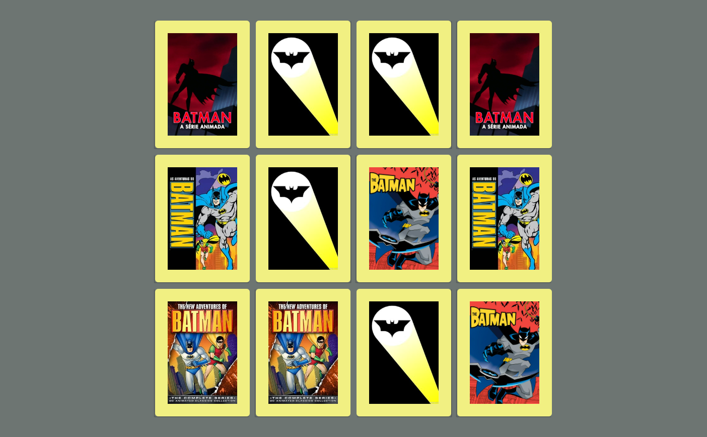

# Projeto Jogo da Memoria 

> Plataforma Digital Innovation One

 BatMemoria realizado durante o Bootcamp Javascript Game Developer,utilizando HTML5, CSS3 e Javascript. 
 Realizado efeitos 3D no CSS e lógica de programação utilizando condicionais, Immediately Invoked Function Expression e manipulação de Array. 
 
 Projeto realizado 21/12/21.

[ 📎 Clique aqui para acessar] (https://michel-maia.github.io/Projeto-Jogo-da-Memoria-BatMemoria/)

 ## Tecnologias 🖥️ 🚀 

- HTML
- CSS
- JavaScript
- Git e GitHub